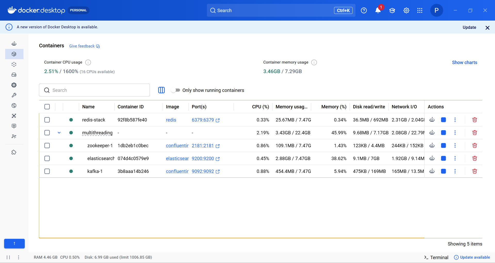
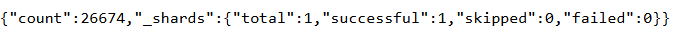
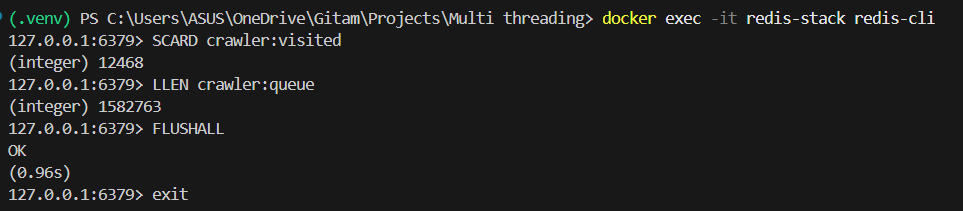

# Distributed Web Search Engine

A distributed web crawling and search infrastructure inspired by large-scale search engine architectures and modern search backend systems. The system is designed to simulate scalable web crawling workflows using Redis-backed frontier management, Kafka-based distributed URL streaming, Elasticsearch bulk indexing, and horizontally scalable crawler workers.

---

# Overview

This project implements a distributed crawling pipeline capable of:

- Large-scale crawl frontier management
- Distributed URL discovery and processing
- Fault-tolerant crawl coordination
- Bulk-based search indexing
- Persistent queue recovery
- Multi-worker crawl execution
- Real-time crawl monitoring
- Low-latency full-text search

The architecture focuses on scalability, fault recovery, and distributed systems concepts commonly used in modern backend infrastructure.

---

# Key Features

## Distributed Crawl Frontier
- Redis-backed persistent BFS crawl frontier
- URL deduplication using distributed sets
- Inflight task leasing and worker recovery
- Persistent crawl-state coordination

## Distributed URL Streaming
- Kafka-based batch URL publishing
- Distributed crawl event propagation
- Batched producer workflows for throughput optimization

## Elasticsearch Search Infrastructure
- Full-text indexing using Elasticsearch
- Bulk API indexing pipelines
- Optimized low-latency search retrieval
- Multi-field search support

## Fault Tolerance
- Worker crash recovery using lease expiration
- Stale-task requeueing
- Persistent queue state across crawler restarts

## Scalable Worker Architecture
- Horizontally scalable crawler workers
- Multi-threaded crawl execution
- Batch-oriented crawl processing pipelines

---

# System Architecture


The system uses a Redis-backed distributed crawl frontier with lease-based task coordination, horizontally scalable crawler workers, Kafka-based batch URL streaming, and Elasticsearch bulk indexing for low-latency search retrieval.

# Distributed Infrastructure

The search engine runs on a fully containerized distributed stack using:

- Elasticsearch
- Kafka
- Redis
- Zookeeper
- Multi-threaded crawler workers

### Live Container Runtime


---

# Tech Stack

| Layer | Technology |
|---|---|
| Backend | Python |
| Crawl Parsing | Requests, BeautifulSoup |
| Distributed Queue | Redis |
| URL Streaming | Apache Kafka |
| Search Engine | Elasticsearch |
| Frontend | Flask |
| Containerization & Orchestration | Docker, Kubernetes (planned/experimental) |

---

# Distributed Systems Concepts Implemented

- Distributed crawl frontier management
- Persistent queue coordination
- Lease-based task ownership
- Worker recovery workflows
- Crawl-state persistence
- Distributed URL propagation
- Bulk indexing pipelines
- Horizontal worker scaling
- Queue deduplication
- Frontier graph expansion
- Fault-tolerant crawl recovery

---

# Benchmark Results

## Benchmark Environment
- Multi-worker distributed crawler execution
- Redis-backed persistent frontier
- Elasticsearch bulk indexing
- Kafka batch publishing
- Dockerized infrastructure deployment

## Observed Results

| Metric | Result |
|---|---|
| Indexed Documents | 26,674+ |
| Discovered URLs | 1,800,000+ |
| Search Backend | Elastic Cloud |
| Deployment | Render + Elastic Cloud |
| Search Latency | <100ms average |
| Crawl Workers | Multi-worker |
| Queue Coordination | Redis-backed persistent frontier |
| Fault Recovery | Lease-based task recovery |

---

# Performance Highlights

- Supported large-scale crawl frontier simulations exceeding 1.8M discovered URLs
- Indexed 26K+ searchable documents using Elasticsearch bulk indexing
- Maintained persistent crawl-state recovery using Redis inflight leasing
- Implemented batch-oriented Kafka URL streaming pipelines
- Enabled scalable distributed crawl execution using multi-worker architecture

---

# Fault Tolerance Design

The crawler infrastructure implements fault-tolerant coordination through:

- Redis-backed inflight task leasing
- Lease expiration recovery
- Stale worker requeueing
- Persistent distributed frontier state
- Restart-safe crawl workflows

This enables crawler workers to recover gracefully from failures without losing crawl-state consistency.

---

# Search Features

- Full-text search
- Title + content indexing
- Elasticsearch BM25 ranking
- Low-latency retrieval
- Distributed indexing workflows
- Fuzzy search support
- BM25 relevance scoring
- Multi-field ranking
- Cloud-hosted Elasticsearch infrastructure
- Distributed search serving

---

# Example Queries

- machine learning
- distributed systems
- artificial intelligence
- operating systems
- computer networks

---

# Future Improvements

- Async crawler pipelines using aiohttp + asyncio
- Adaptive frontier throttling
- Crawl prioritization algorithms
- Domain-aware scheduling
- PageRank-based ranking
- Prometheus + Grafana observability
- Kubernetes autoscaling
- Distributed shard-aware indexing
- Robots.txt compliance
- Crawl politeness policies

---
# Cloud Deployment

The distributed search infrastructure is deployed using:

- Render (Flask search service hosting)
- Elastic Cloud (managed Elasticsearch cluster)
- Dockerized local crawling infrastructure
- Redis-backed persistent crawl frontier
- Kafka-based distributed URL streaming

The production deployment separates:
- crawl infrastructure
- indexing infrastructure
- search serving infrastructure

This architecture mirrors real-world distributed search system design patterns.

---

# Running the Project

## Start Infrastructure

```bash
docker-compose up -d
```

## Start Redis

```bash
docker run -d --name redis-stack -p 6379:6379 redis
```

## Start Multiple Crawler Workers

```bash
python crawler.py
```

Run multiple crawler workers in separate terminals.

## Start Search UI

```bash
python app.py
```

Open:

```text
http://localhost:5000
```

---

# Screenshots

## Elasticsearch Benchmark


## Redis Frontier Metrics


---

# Engineering Focus

This project focuses heavily on:
- Distributed systems engineering
- Backend infrastructure design
- Fault-tolerant queue coordination
- Search infrastructure
- Crawl scalability
- Distributed workload execution
- Persistent frontier management

---

# Author

Parthasarathi Sadanala